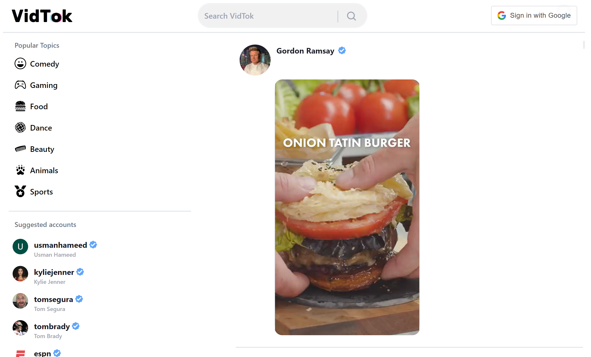
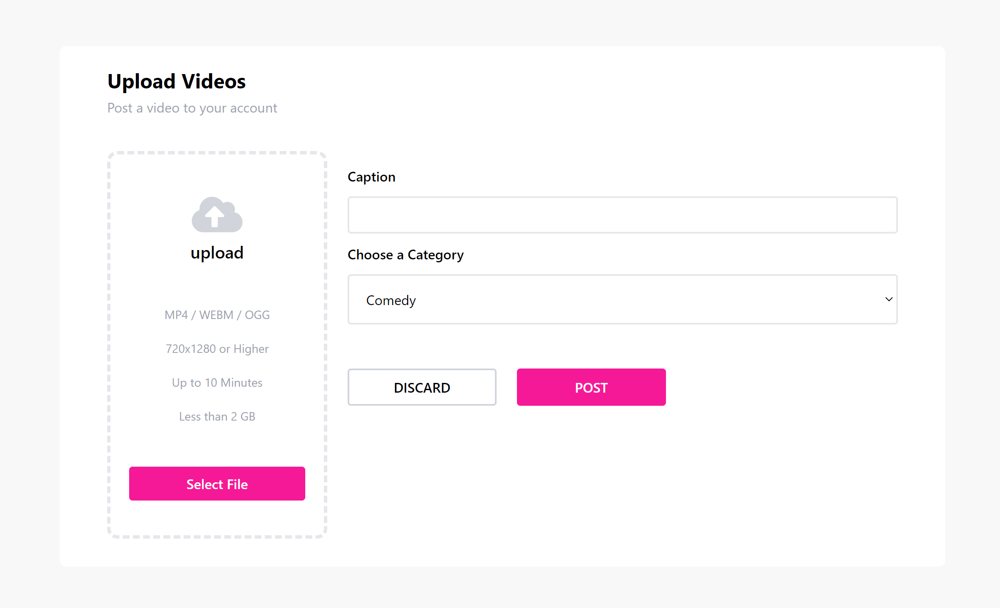
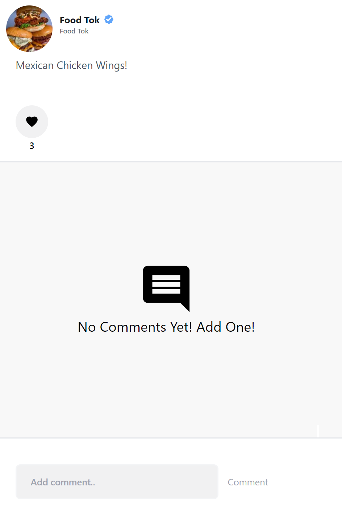

# VidTok

[VidTok LIVE on Vercel](https://vidtok-eta.vercel.app/)

VidTok is a full-stack clone of the popular video-streaming platform TikTok, where users can watch videos and upload their own video content to the web

</img>

# Technologies Used

* Backend 
  * Sanity IO
  * Google Auth API
* Frontend
  * TypeScript
  * React
  * Next.js
  * Tailwind
* Hosting
  * Vercel

# Features

## Discover Page

Upon loading, users will be directed to the Discover page, where they can view the most recently posted videos. Along the left of the screen, there are 6 topic icons which the user can click to be given a filtered list of videos according to that topic. Under that is a list of suggested accounts to view.

</img>

## Google Authentication

Users can create an account by linking to their Google Account via the Google Auth API icon on the top right of the screen. Creating an account will allow users to gain access to VidTok's 'upload,' 'like,' and 'comment' features.

</img>

</img>

## Search

On the Discover page, a search bar is rendered in the middle of the top navigation bar. This search bar triggers a handleSearch() function which makes a GET request to "/api/search/" returning the correlating accounts and videos. This search includes video captions as well and is structured by specific GraphQL structured backend queries to Sanity.io data store

```javascript
// components/Navbar.tsx
const [searchValue, setSearchValue] = useState('')
const router = useRouter()

const handleSearch = (e: {preventDefault: () => void}) => {
    e.preventDefault();
    if(searchValue) {
        router.push(`/search/${searchValue}`)
    }
}

```

```javascript
// pages/search/[searchTerm].tsx
export const getServerSideProps = async ({
    params: { searchTerm },
  }: {
    params: { searchTerm: string };
  }) => {
    const res = await axios.get(`${BASE_URL}/api/search/${searchTerm}`);
  
    return {
      props: { videos: res.data }
    };
};

```

```javascript
// pages/api/search/[searchTerm].ts
export default async function handler(req: NextApiRequest, res: NextApiResponse) {
  if (req.method === 'GET') {
    const { searchTerm } = req.query;
    const videosQuery = searchPostsQuery(searchTerm);
    const videos = await client.fetch(videosQuery);

    res.status(200).json(videos);
  }
}

```

## Uploading Tracks

Users can upload videos to VidTok, providing a caption and selecting a topic. The video will then be listed on the live feed as well as that person's personal profile page.

</img>

## Creating Comments

Users can interact with one another by entering comments into the comment box on any video page.

</img>

## Future Features
* Following between users
* Liking Comments 